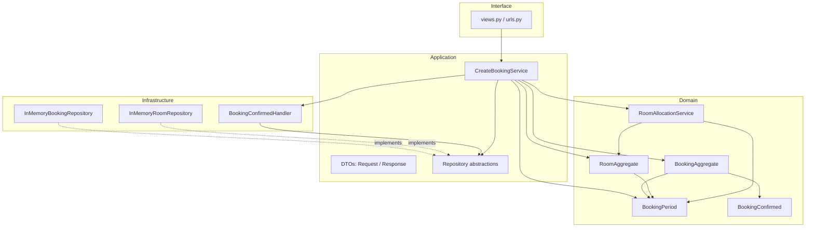

# Room Booking — Architecture

## Domain summary

**Scope:** a small room-booking system with two connected use cases —
creating a booking, and (as its automatic follow-up) reserving the room's
schedule slot. Web interfaces, a real database, deployment and messaging
infrastructure are explicitly out of scope, per the coursework brief.

**Aggregates**

| Aggregate | Root | Contents | Invariant |
|---|---|---|---|
| A — Booking | `BookingAggregate` | id, room_id, requester, attendee_count, period, status | Status only moves forward: `PENDING → CONFIRMED → CANCELLED/REJECTED` (BR2) |
| B — Room | `RoomAggregate` | id, name, capacity, reserved slots (list of `BookingPeriod`) | No two reserved slots may overlap (BR3) |

## Layer dependencies

Clean Architecture's dependency rule holds throughout: arrows below point
**inward**, and nothing in `domain/` imports from any other layer.



- **Domain** — `BookingAggregate`, `RoomAggregate`, `BookingPeriod`,
  `RoomAllocationService`, `BookingConfirmed`, and the business-rule
  exceptions. Zero outward dependencies.
- **Application** — `CreateBookingService` (the one Application Service),
  its input/output DTOs, and the two repository *abstractions*
  (`BookingRepository`, `RoomRepository`). Depends only on Domain.
- **Infrastructure** — `InMemoryBookingRepository`,
  `InMemoryRoomRepository` (concrete repository implementations) and
  `BookingConfirmedHandler` (wires the BR5 event to Aggregate B). Depends
  on Application's abstractions and Domain.
- **Interface** — the Django view/urls. Depends on Application only; never
  imports a Domain object directly.

**Dependency injection**: `CreateBookingService.__init__` takes
`BookingRepository` / `RoomRepository` as constructor arguments. Concrete
`InMemory...Repository` instances are constructed in the Interface layer
(or in tests) and passed in — the service never constructs its own
dependencies.

**Layer Supertype**: not used. The aggregates, DTOs and repositories are
few and simple enough (a handful of fields each) that a shared base class
would add indirection without removing duplication — there is no repeated
structure across them worth factoring out.

## BR5 event flow (Aggregate A → Aggregate B)

```mermaid
sequenceDiagram
    participant Client as Interface (view)
    participant App as CreateBookingService
    participant A as BookingAggregate (A)
    participant Handler as BookingConfirmedHandler
    participant B as RoomAggregate (B)

    Client->>App: execute(CreateBookingRequest)
    App->>App: BR6 - look up Room
    App->>App: BR1 - build BookingPeriod
    App->>App: BR4 - RoomAllocationService.assess(room, ...)
    App->>A: new BookingAggregate(...)
    App->>A: confirm()
    A-->>A: BR2 - PENDING -> CONFIRMED
    A-->>App: BookingConfirmed event
    App->>Handler: handle(event)
    Handler->>B: reserve_slot(period)
    alt no overlap
        B-->>Handler: slot reserved (BR3 OK)
        Handler-->>App: success
        App-->>Client: CreateBookingResponse(success=True)
    else overlap (BR3 violated)
        B-->>Handler: raises OverlappingBookingError
        Handler-->>App: propagates error
        App->>A: reject()
        A-->>A: CONFIRMED -> REJECTED
        App-->>Client: CreateBookingResponse(success=False)
    end
